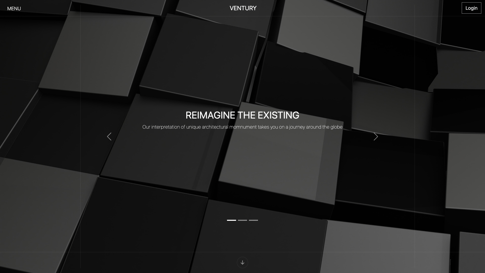

## VENTURY

VENTURY est un site de présentation d'accessoires en ligne. Découvrez une gamme d'accessoires et de bijoux aux bagues.

J'ai conçu et développé un site fictif de présentation de bijoux en utilisant HTML, SASS, Bootstrap et un framework GSAP. De plus
j'ai implémenté une fonctionnalité de simulation de connexion et d'inscription en JavaScript, utilisant "localStorage"
pour stocker les données utilisateur localement.Ce projet m'a permis de mettre en pratique mes compétences en développement web front-end et de créer une expérience utilisateur immersive.

## Installation

01. Clônez le dépôt : git clone https://github.com/lenycoeur/Ventury.git
02. Accédez au répertoire du projet : cd Ventury
